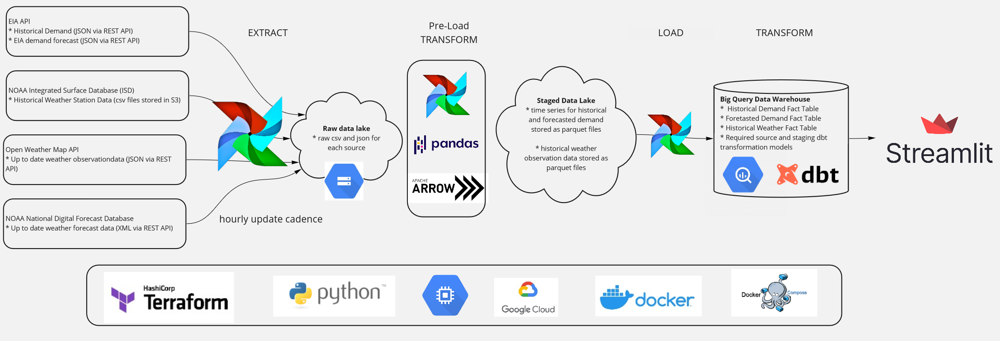
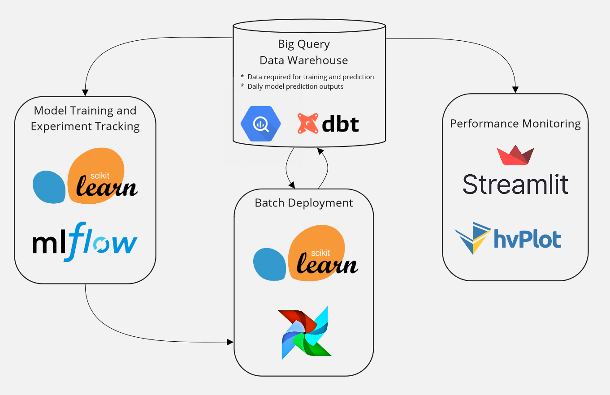
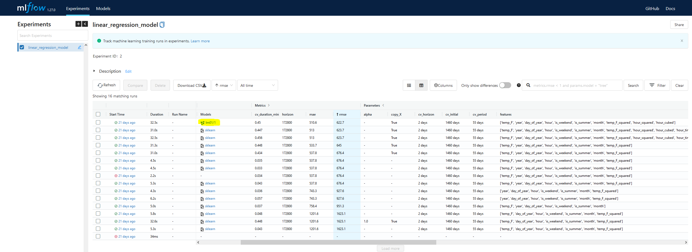
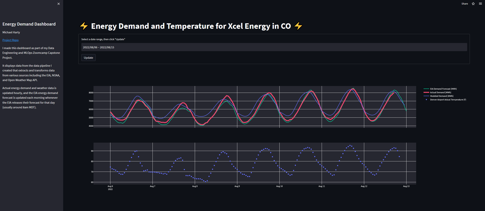
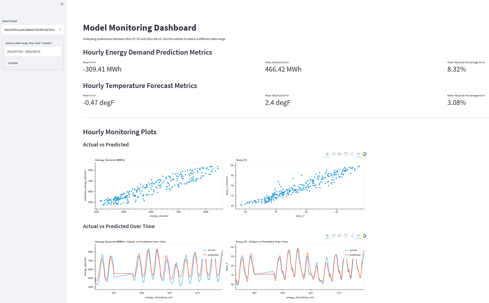

# ⚡ Hourly Energy Demand Forecasting with MLOps

This project delivers a scalable, production-ready machine learning pipeline to forecast **hourly electricity demand** using weather and energy grid data. It combines modern data engineering principles, orchestration, and AI lifecycle management to support smarter, more responsive energy infrastructure.

---

## 📌 Project Summary

- 📈 Forecasts short-term electricity demand at the hourly level
- 🔄 Automates ingestion, transformation, and prediction cycles
- 🧱 Built with modular tools: Airflow, dbt, MLflow, Streamlit, Terraform
- 🎯 Supports energy analysts and grid operators with actionable insights
- ✅ Designed for reproducibility, monitoring, and real-world impact

---

## 🧠 Why It Matters

Electricity must be generated at the exact moment it’s consumed. For grid operators, even minor demand spikes can cause waste or shortages. This project solves that challenge by predicting future electricity needs using weather and historical load data, enabling more efficient generation planning.


## 🧱 System Architecture: End-to-End Workflow

> 

The system is designed as a modular, scalable pipeline that mirrors enterprise-grade data workflows.

1. **Data Ingestion**: Raw data is pulled from APIs (OpenWeatherMap, EIA) or CSVs (NOAA) and stored in cloud buckets.
2. **Transformation Layer**: dbt standardizes, stages, and tests the data into analytics-ready models. Airflow DAGs orchestrate these jobs.
3. **Modeling**: Forecasting models are trained using scikit-learn and logged with MLflow for experiment tracking, version control, and registry.
4. **Monitoring and Visualization**: Streamlit dashboards track predictions, detect drift, and allow for region-based exploration of forecast performance.
5. **Infrastructure**: Everything runs on Dockerized environments and provisioned via Terraform onto GCP.

This modularity allows flexible development and deployment while preserving reproducibility and observability across the entire stack.


---

## 🔄 MLOps Workflow

> 

The project follows a modular MLOps design:
- **Ingestion & Orchestration** via Airflow DAGs
- **Transformation** using dbt with test coverage
- **Model Training & Tuning** using MLflow
- **Monitoring** with dashboards and drift detection
- **Deployment** using batch jobs and version control

---

## ⚙️ Technology Stack

| Layer                  | Tools & Frameworks                                          |
|------------------------|--------------------------------------------------------------|
| **Infrastructure**     | Terraform, Docker, GCP VMs, Cloud Storage                    |
| **Ingestion & Workflow** | Python, Airflow, Weather APIs, Postgres                    |
| **Transformation**     | dbt, Spark, PySpark, SQL                                     |
| **Modeling**           | scikit-learn, MLflow, pandas, time-series regressors         |
| **Monitoring & Reporting** | Streamlit, Plotly, dbt, alert logic                     |

---

## 🔍 Data Sources

| Source                             | Description                                                               |
|------------------------------------|---------------------------------------------------------------------------|
| [EIA Open Data](https://www.eia.gov/opendata/)                      | Hourly electricity load & forecast data                                   |
| [NOAA ISD](https://registry.opendata.aws/noaa-isd/)                           | Historical hourly weather observations from 30,000+ global stations       |
| [OpenWeatherMap API](https://openweathermap.org/api)                 | Live weather observation data via REST API                                |
| [NOAA NDFD](https://registry.opendata.aws/noaa-ndfd/)                          | Gridded weather forecasts in XML and CSV format                           |

---

## 🗂️ Project Modules

| Folder                        | Purpose                                                                  |
|------------------------------|--------------------------------------------------------------------------|
| `01_data_ingestion/`         | API ingestion + CSV parsing for weather + grid data                      |
| `02_infra_terraform/`        | Infrastructure provisioning for compute/storage                          |
| `03_pipeline_airflow/`       | Airflow DAGs to schedule data loads and batch predictions                |
| `04_transform_dbt/`          | dbt models to normalize and stage data                                   |
| `05_dashboard_streamlit/`    | Frontend visualization of actual vs. predicted energy usage              |
| `06_model_training_mlflow/`  | Model development notebooks, MLflow integration                          |
| `07_deployment_scripts/`     | Batch scoring jobs                                                        |
| `08_monitoring_alerts/`      | Dashboard & drift detection interface                                    |

---

## 🧪 Experiment Tracking

> 

- All experiments logged using **MLflow**
- Model registry tracks production-ready vs. candidate models
- Feature versions and forecast metrics tracked across runs

---

## 📊 Dashboards

> 

- Forecast vs. actual demand, weather overlays
- Region and time-range filtering
- Error tracking and outlier display

> 

- Live pipeline health status
- Drift detection based on recent prediction deltas
- Alerts for schema changes or data freshness issues

---

## 🛠 How to Reproduce

```bash
# Clone the repository
git clone https://github.com/deebafar04/MLOps-Based-Hourly-Energy-Demand-Prediction.git
cd MLOps-Based-Hourly-Energy-Demand-Prediction

# Launch Airflow for pipeline execution
cd 03_pipeline_airflow
docker-compose up

# Run dbt transformations
cd 04_transform_dbt
dbt run

# Train models with MLflow logging
cd 06_model_training_mlflow
jupyter notebook

# Launch dashboard
cd 05_dashboard_streamlit
streamlit run app.py
```

---

## 📈 Forecasting Techniques Used

- Feature engineering with lag variables and weather features
- Linear regression and ensemble methods (scikit-learn)
- Time-series cross-validation
- Bias monitoring and retraining triggers

---

## 📚 What This Project Demonstrates

- ✅ Modern orchestration and model lifecycle design
- ✅ Real-world energy and weather domain complexity
- ✅ Automated ingestion, tracking, and dashboarding
- ✅ Attention to testing, reproducibility, and deployment


---

## 👩🏻‍💻 About the Author

I'm **Deeba Farheen H N**, a data engineer and former software developer currently pursuing my M.S. in Data Science at the University of Michigan. I’ve worked on complex data platforms at Amazon, Calyx, and Parexel, and I love building scalable data systems that create real-world impact.

- 🔗 [LinkedIn Profile](https://linkedin.com/in/deeba-farheen-h-n)
- 💻 [GitHub Portfolio](https://github.com/deebafar04)
- 📫 [Email Me](mailto:deebafar04@gmail.com)

